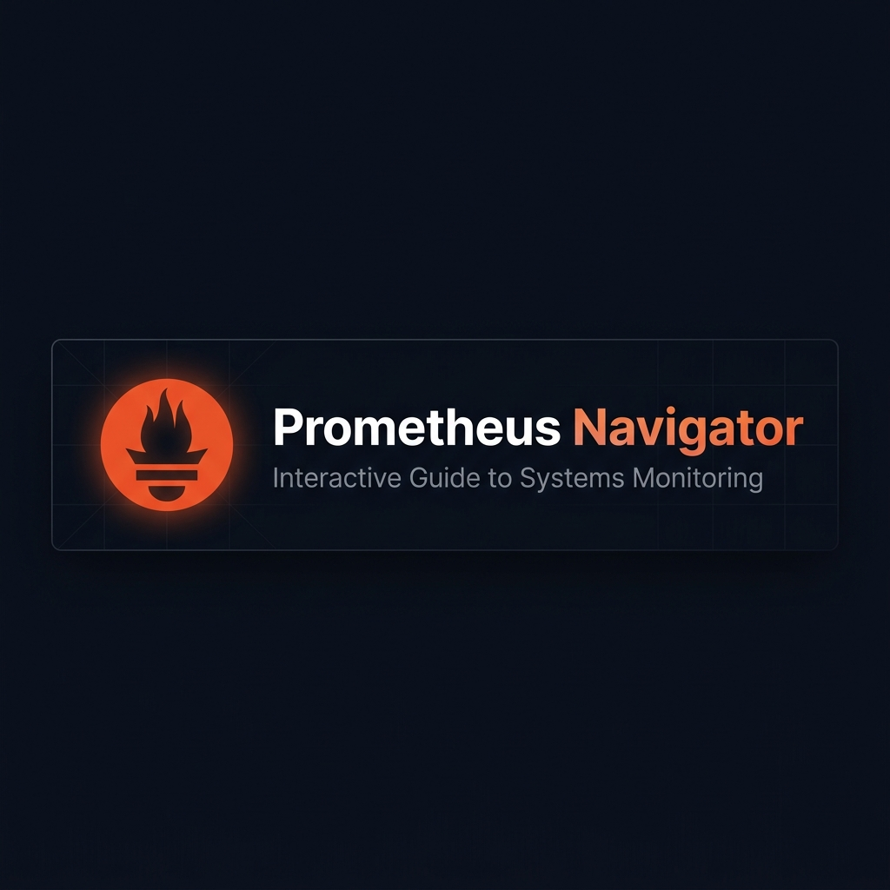

<div align="center">
  

<h1 align="center">🔥 Prometheus Navigator</h1>

  
  
  
  
  
  
  

  **A premium, interactive single-page web app to learn Prometheus monitoring, architecture, installation, and PromQL — all in one place.**

</div>

---

## 🌐 View Live Site

The project is live and accessible online.

<a href="https://ajaygangwar945.github.io/Prometheus-Navigator/">
  
</a>

---

## 🚀 Key Features

* **Interactive Architecture Diagram**: Clickable SVG flowchart mapping Jobs/Exporters, Pushgateway, Prometheus Server, Alertmanager, and Grafana — tap any node to explore its role and sample metrics schema.
* **OS Installation Hub**: Tab-based installation guides for Linux/Unix, macOS (Homebrew), Windows, and Docker — each with syntax-highlighted terminal consoles and one-click copy buttons.
* **Metrics Type Explorer**: Visual glassmorphism cards explaining Counters, Gauges, Histograms, and Summaries with real exposition format examples.
* **Live Metrics Simulator**: Trigger mock HTTP requests, memory fluctuations, and latency events — watch the `/metrics` output update in real time with highlighted changed lines.
* **PromQL Chart Playground**: Real-time SVG time-series chart with smooth bezier paths, gradient fills, and interactive mouse tooltips — switch queries from the dropdown to redraw the chart live.
* **Dark / Light Theme**: One-click theme toggle with smooth CSS transitions across all components.

---

## 📁 File Structure

```text
Prometheus-Navigator/
├── .github/
│   └── workflows/
│       └── docker.yaml
├── .dockerignore
├── .gitignore
├── banner.png
├── Dockerfile
├── nginx.conf
├── serve.py
├── HOW_I_BUILT_THIS.txt
├── index.html
└── README.md
```

---

## 💻 Local Run Methods

You can launch and view the interactive guide locally using any of these methods:

### Method 1: Direct File Launch
Simply double-click the `index.html` file to open it in your default web browser (Chrome, Edge, Firefox, etc.).

### Method 2: Python Development Server
To run the project on a local HTTP port:
```bash
python -m http.server 8000
```
Open `http://localhost:8000` in your web browser.

### Method 3: No-Cache Dev Server (included)
```bash
python serve.py
```
Open `http://localhost:8000` — always serves fresh files, no browser caching.

---

## 🐳 Host Page in Docker

Host the navigator locally as an Nginx-backed web server:

```bash
# Build the Nginx Alpine container
docker build -t prometheus-navigator .

# Run the container locally on port 8080
docker run -d -p 8080:80 --name prom-navigator prometheus-navigator
```
Go to `http://localhost:8080` in your web browser.

---

## ⚙️ CI/CD Automation

Whenever changes are pushed to the `main` branch, the workflow inside [.github/workflows/docker.yaml](.github/workflows/docker.yaml) builds the Dockerfile, tags the image, and pushes it directly to [Docker Hub](https://hub.docker.com/r/ajaygangwar945/prometheus-navigator).

---

<div align="center">
  <sub>Built for learning Prometheus monitoring, metrics, and PromQL from the ground up.</sub>
  <br>
  <sub>
    <a href="https://prometheus.io" target="_blank">Prometheus.io</a> |
    <a href="https://prometheus.io/docs/prometheus/latest/querying/basics/" target="_blank">PromQL Docs</a> |
    <a href="https://hub.docker.com/r/ajaygangwar945/prometheus-navigator" target="_blank">Docker Hub</a>
  </sub>
</div>
